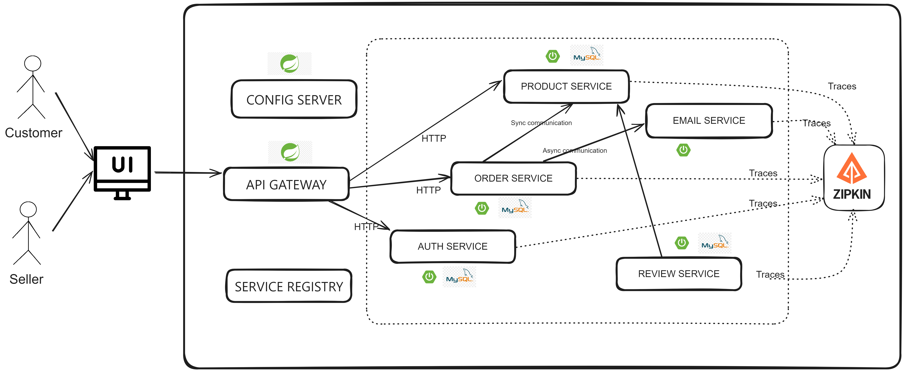

# CommunityCart, a microservice application
## Architecture diagram

**CommunityCart - An E-commerce app for local vendors** 
- Full Stack Web Development
  
 - An e-commerce app designed for local vendors within 5-10kms, using a microservices architecture to ensure scalability and flexibility in the platform.
 - Designed and implemented RESTful API for product catalog, user authentication, order processing, and payment integration.
 - Used Google Places API, Stripe payment gateway.
   
*Java 17, Spring Boot 3, ReactJS, MySQL, Docker*
